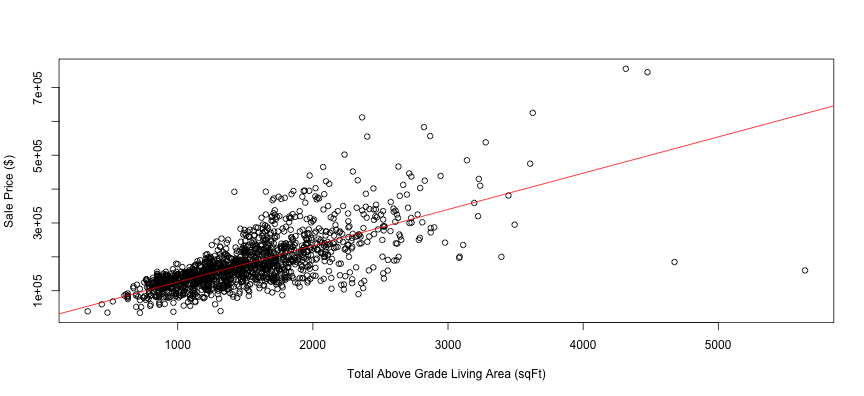

## Overview

- Investment bank client
- Business Question: How do we optimally allocate investment dollars into mortgage-backed securities?
- Investigate and quantify impact of factors that drive home prices. 

---
## The Dataset...


```r
setwd("~/Desktop/Data Science with R/Developing Data Products/Week 4 Assignment/Week4Assignment")
library(tidyverse)
housingdata <- read.csv("housingdata.csv")
housingdata <- housingdata %>% select(lotarea,housestyle,overallcond,heating,
                                    centralair,grlivarea,fullbath,halfbath,
                                    bedroomabvgr,totrmsabvgrd,saleprice)
head(housingdata,n=3L)
```

```
##   lotarea housestyle overallcond heating centralair grlivarea fullbath halfbath
## 1    8450     2Story           5    GasA          Y      1710        2        1
## 2    9600     1Story           8    GasA          Y      1262        2        0
## 3   11250     2Story           5    GasA          Y      1786        2        1
##   bedroomabvgr totrmsabvgrd saleprice
## 1            3            8    208500
## 2            3            6    181500
## 3            3            6    223500
```

---
## Example Box Plot Output


```r
boxplot(saleprice~overallcond,data=housingdata,
        xlab = "Overall Home Condition (1=Poor, 9=Excellent)",
        ylab = "Sale Price ($)")
```


---
## Example Linear Regression Output

```r
fit <- lm(saleprice~grlivarea,data=housingdata)
plot(saleprice~grlivarea,data=housingdata,
        xlab = "Total Above Grade Living Area (sqFt)",
        ylab = "Sale Price ($)")
abline(fit,col=2)
```


---
